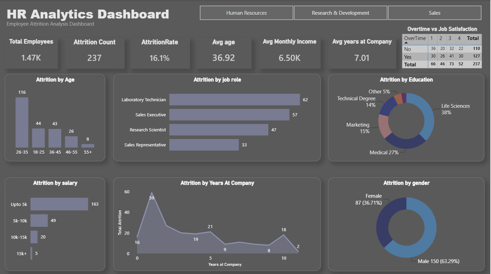

# 📊 HR Analytics Dashboard

An interactive HR Analytics Dashboard built using **Power BI** to analyze employee attrition and identify key workforce trends.

---

## 📌 Project Overview

This dashboard provides insights into employee attrition by analyzing factors such as age, department, job role, education, salary, gender, overtime, and years at the company. It helps HR teams understand attrition patterns and supports data-driven decision making.

---

## 🎯 Key Insights

- Analyzed employee attrition across different age groups.
- Identified attrition trends by job role and department.
- Compared attrition based on education level and salary.
- Evaluated the impact of overtime on employee attrition.
- Visualized attrition by gender and years at the company.
- Created interactive filters for department-wise analysis.

---

## 🛠️ Tools & Technologies

- Power BI
- Microsoft Excel
- Power Query
- DAX (Data Analysis Expressions)

---

## 📂 Dataset

- HR Analytics Dataset (CSV)

---

## 📸 Dashboard Preview

---

## 🎥 Dashboard Demo

A short walkthrough of the interactive dashboard is included in this repository.

**File:** `Dashboard_Demo.mp4`

---

## 📁 Repository Contents

- `HR_Analytics_Dashboard.pbix` – Power BI Dashboard
- `HR_Analytics_Dataset.csv` – Dataset
- `Dashboard.png` – Dashboard Screenshot
- `Dashboard_Demo.mp4` – Dashboard Demo Video

---

## 👨‍💻 Author

**Prashant Bisht**

Aspiring Data Analyst | Power BI | Excel | Data Visualization
